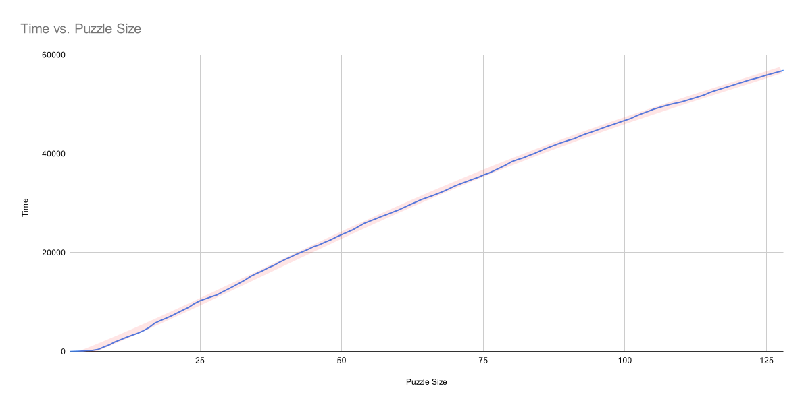
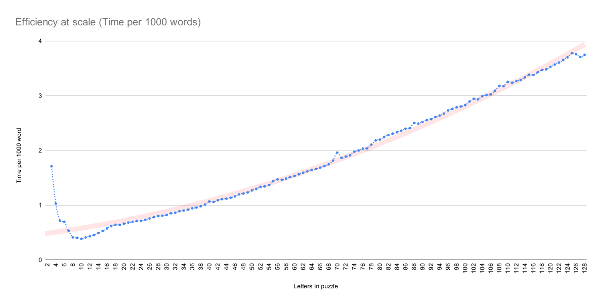
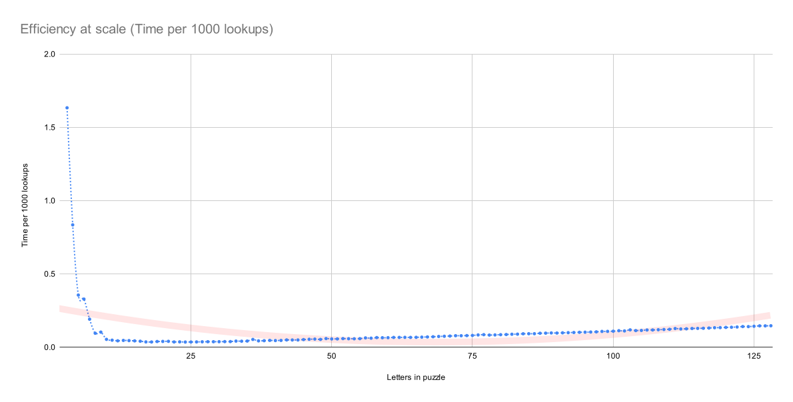

cp # Benchmark Report — benchmark.py (Boggle Solver)
These benchmarks evaluate how boggle_solver.py scales with puzzle size, dictionary size, and lookup volume. The aim is to expose bottlenecks, highlight linear vs non-linear growth, and identify where inefficiencies get amplified at scale.

---
## Time relative to puzzle size

This trend is almost perfectly linear. That is good: it means the solver’s core traversal and pruning logic scale predictably with board dimension.

---
## Time relative to words found

This should not be flat.
As boards get larger, repeated prefix hits and duplicated search paths should increase total work per discovered word. The flatness indicates that the current implementation pays similar costs regardless of how many results come out.
---
## Time relative to puzzle size

This staying flat is excellent and agrees with the above statement. It means dictionary lookup cost is stable even under higher load. As puzzle size increases, lookup behaviour does not degrade — exactly what you want from a prefix tree or optimised indexed structure.

---
### Interpretation
- Linear puzzle-size growth → overall solver complexity is structurally sound but still contains inflated per-cell overhead.
- Flat words-found curve → most time is spent in search traversal rather than in result accumulation.
- Flat lookup cost → dictionary structure is not the current bottleneck; the expansion logic is.

---

### Takeaways
- Improve branching heuristics or early cut-offs; scale amplifies existing hotspots.
- Profile neighbour expansion and prefix checking — that’s where linear scaling hides multiplicative overhead.
- Dictionary structure is fine; focus optimisation elsewhere.

